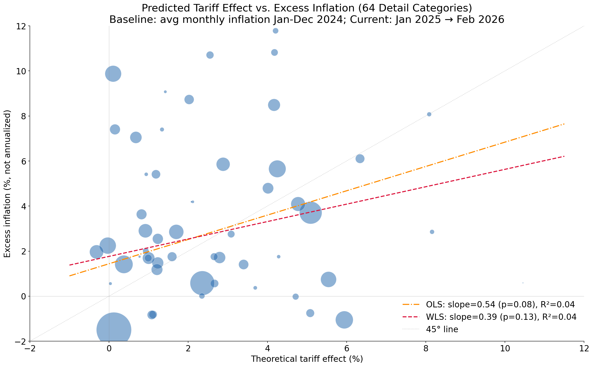
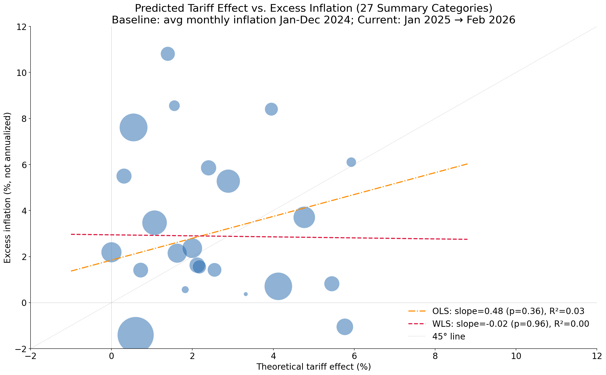
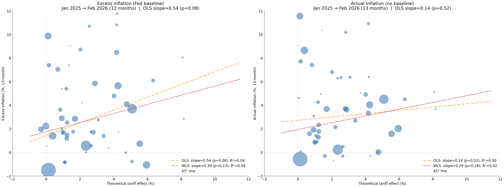
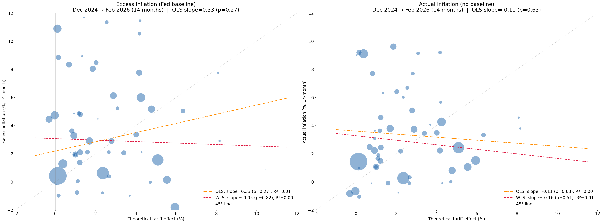

# Comparison with Fed Board FEDS Note Part II (Minton, Ray & Somale, April 2026)

On the same day that we released our [note](), the Board of Governors released a similar note that reaches a somewhat different conclusion in the category-level cross section. Once we align our exercise to the Fed’s Figure A3 choices, we obtain a similar positive cross-sectional relationship, suggesting the main disagreement is not the construction of predicted tariff exposure per se, but rather the treatment of inflation timing, the baseline for “excess” inflation, and regression weighting.

## Focus

This comparison focuses on the **category-by-category cross-sectional validation**: does the predicted tariff effect for each PCE goods category correlate with observed excess inflation in that category? This is the Fed's Figure A3 test — regressing excess inflation on predicted tariff effects across roughly 60 core goods categories. At the end of the document, we briefly discuss the pass-through regressions used by the Board and how they answer a somewhat different question. 

## Key Methodology Differences

| Dimension | Our Pipeline | Fed (FEDS Note) |
|-----------|-------------|-----------------|
| **IO table** | BEA Summary (71 commodities, 2024) or Detail (402 commodities, 2017) | Global Value Chain model (140 industries x 8 regions) |
| **Tariff rates** | Revenue-based (duties collected / import value) | Statutory/announced rates |
| **Leontief inverse** | BEA published Total Requirements (commodity-by-commodity) | GVC-based, captures cross-country intermediate flows |
| **Pass-through** | One-time level shift (full pass-through) | Distributed lag regression (partial, time-varying) |
| **PCE categories** | 27 (summary) or 64 (detail) | ~59 |
| **Predicted aggregate effect** | ~2.1 pp on core goods | ~3.1 pp on core goods |

In the sections below, we focus on several differences that matter most for interpreting the cross-sectional comparison. :contentReference[oaicite:1]{index=1}

## Replicating Minton, Ray & Somale, April 2026

In our data pipeline, we are able to broadly mimic the results of MRS. We do this by using the BEA detail IO table, with the caveat that it comes from 2017. We continue to use realized tariff rates rather than the statutory rates they use.

Second, we use the exact windows they describe for both (1) measured inflation and (2) the excess-inflation baseline.

The figure below illustrates the results of this exercise.

While the fit is not exact, it is in the same ballpark. The OLS slope coefficient is 0.54, somewhat below their reported slope coefficient of 0.78. When one examines the individual categories and compares them to their Figure A3, the results are very similar. For example, we find Film and photographic supplies to have a predicted effect of about 2 percent and excess inflation of about -25 percent.

To us, this suggests that the main difference is **not** the construction of the predicted tariff effect per se. The exposure measures are evidently similar enough to generate a similar positive cross-sectional relationship once we align the timing and inflation definitions more closely. Below, we explore more carefull three issues:

- The role of aggregation
- The pre-period and window of inflation to consider

### The role of aggregation

The difference does not appear to be about aggregation. In our note, we used the BEA summary IO table and mapped results into 27 PCE summary categories. To evaluate whether aggregation is driving the difference, we re-ran the comparison using the same window and excess-inflation definition used in the MRS note. The figure below reports the results.

The main takeaway is not simply that the relationship weakens under aggregation. Rather, it is that **unweighted OLS remains positive, while the weighted least squares slope is near zero**. In other words, moving to the summary categories does not eliminate the positive cross-sectional relationship altogether, but it does make the result more sensitive to weighting.

We do think these comparisons are noisy, and in that sense they still support our broader story. But we would not argue that the difference in conclusions is primarily about aggregation alone. 

### The pre-period and window of inflation to consider

There are really two separate issues here: **what counts as normal inflation**, and **when the inflation window starts**.

First, in our note we chose **not** to define inflation relative to a separate baseline period. One reason was that a natural pre-period was not obvious. Another was that core goods inflation had already started to rise by mid-2024, possibly in response to tariffs, making that period seem problematic as a benchmark. The downside of our approach is that it does not control for category-specific inflation trends.

Second, there is the question of when to begin the inflation window itself. In our note, we focused on the period starting in December 2024. The MRS note starts in January 2025. That seemingly small timing difference turns out to matter qualitatively as well. 

#### 1. The excess-inflation baseline

Below is a side-by-side comparison of inflation net of average inflation observed from January 2024 through December 2024 versus realized inflation, both over the January 2025 to February 2026 window.

What happens is that the relationship flattens considerably. The slopes remain positive, but OLS is no longer statistically significant. This suggests that the cross-sectional conclusion is sensitive to what is treated as "normal inflation." 

#### 2. The start date of the inflation window

A related issue is when to start measuring inflation. Below, we keep the same excess-inflation baseline, but extend the inflation window back so that it begins in December 2024 rather than January 2025.

Here, the slope flattens further, and for actual inflation the slope turns negative. That result is more consistent with the conclusions in our original note. 

## Implications

Our main takeaway is straightforward. Once we align our exercise more closely to the Fed's Figure A3 choices, we obtain a similar positive cross-sectional relationship. That suggests the disagreement is **not primarily about the construction of predicted tariff exposure**.

Instead, the main differences appear to lie in the treatment of the dependent variable: the choice of excess-inflation baseline, the start date of the inflation window, and the use of weighting. Under the Boards's preferred choices, the cross section looks more supportive of tariff passing through to inflation. Under nearby but still reasonable alternatives, the relationship becomes notably flatter and in some cases close to zero.

For that reason, we view Figure A3 as informative, but not decisive on its own. It is best understood as one specification whose conclusions are meaningfully sensitive to timing, baseline construction, and weighting choices. But, there is a substantive case behind our alternative view that inflation does not appear to be behind goods inflation. 

